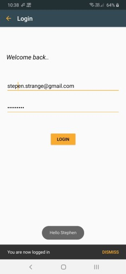
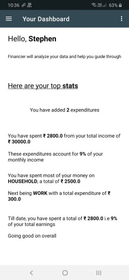
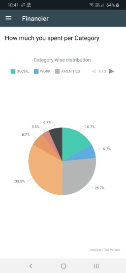
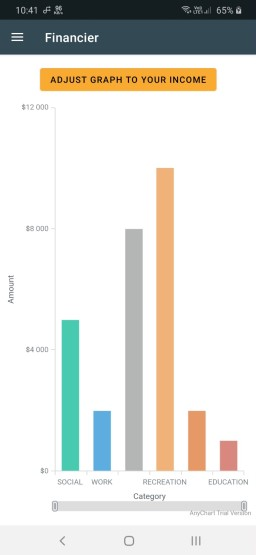
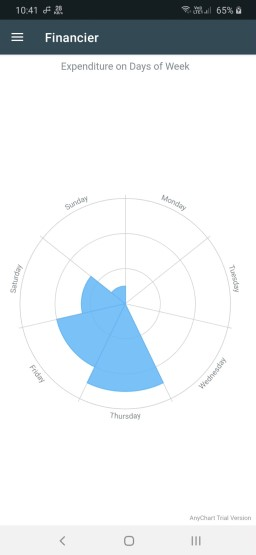
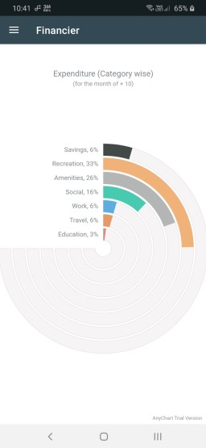
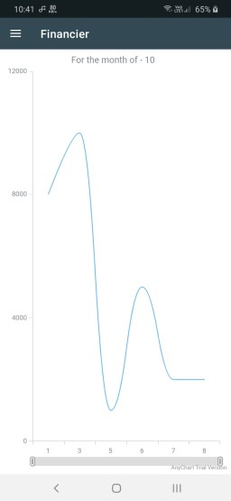

#### TO-DO
- [x] Make README
- [ ] Add more screenshots
- [ ] Add more screenshots
- [ ] Optimize code
- [ ] Add deletion feature
- [ ] Add APK

> If you wish to fork this repository, please contact me via email. 
> This application is still under further development and this repository would be updated in future  
> [Email Me](mailto:nikhilanand1006@gmail.com)

# Financier

Financier is an expenditure management application written in Android.  
It records expenditures and displays them under certain categories.  
Financier also helps you visualize these expenditures using various graphs from [AnyChartAndroid](https://github.com/AnyChart/AnyChart-Android).

## Features

* Records your expenditures and views them in the order of recent spent expenditure.
* Shows personalized stats for your spending behaviour
* Visualizes your expenditure in various formats
* Works offline using a local cache to avoid constant internet use
* Light-weight and fast

## Technologies
 * [Android (Java)](https://www.android.com/intl/en_in/)
 * [Firebase (Cloud Firestore)](https://firebase.google.com/docs/firestore) - Online Database
 * [SQLite](https://developer.android.com/reference/android/database/sqlite/SQLiteDatabase) - Local caching database
 * [AnyChartsAndroid](https://github.com/AnyChart/AnyChart-Android) - Visualizations
 
## Installation and use
* ### Requirements
    * [Android Studio](https://developer.android.com/studio)
    * [Gradle](https://gradle.org/)
    * [Java JDK](https://www.oracle.com/in/java/technologies/javase-downloads.html)
* ### Usage
    * #### Downloading the repo on the system
        * ##### Clone the repository from Github
            Open a new command prompt (or any prompt according to your OS) and type `git clone https://github.com/A-Nikhil/Financier.git`  
            Allow the process to complete
        * ##### Download Zip
            Go to the repository and click on the `Code` button and click on **Download ZIP**. Wait for the ZIP to be downloaded and then extract it.
    * #### Opening in Android Studio
        Open your Android Studio and click on *Open or Import* and then navigate to the corresponding folder.  
        Android Studio will open your project, and the Gradle will start to build.

## Screenshots

### Screens
|  |  |  |
|  :---: | :---: | :---: |
| Welcome Page | Login Page | Signup Page |  

|  |
|  :---: | 
| Dashboard | 

### Visualizations
|  |  |  |
|  :---: | :---: | :---: |
| Pie Chart | Column Chart | Polar Chart |  

|  |  |
|  :---: | :---: |
| Circular Gauge | Spline Chart |

 